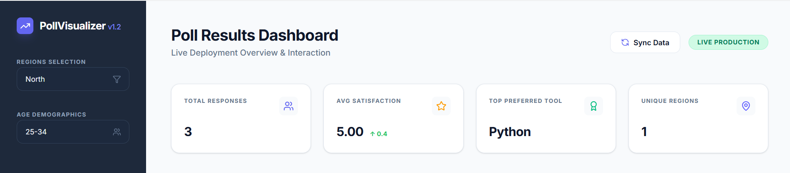
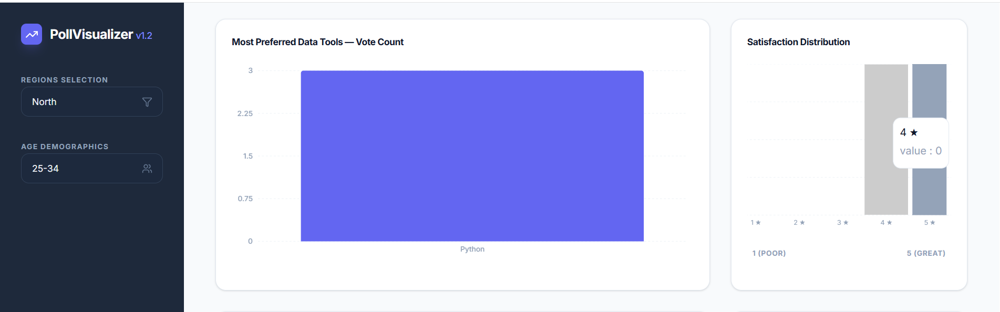
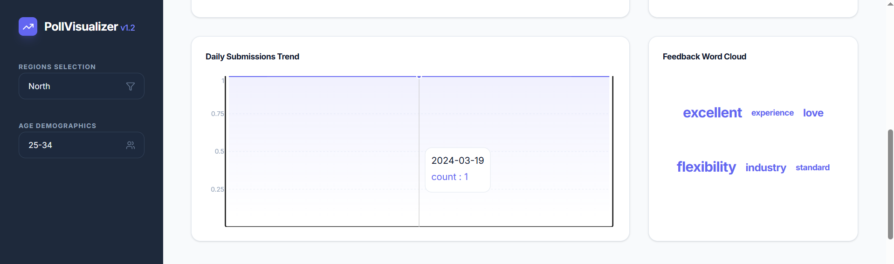
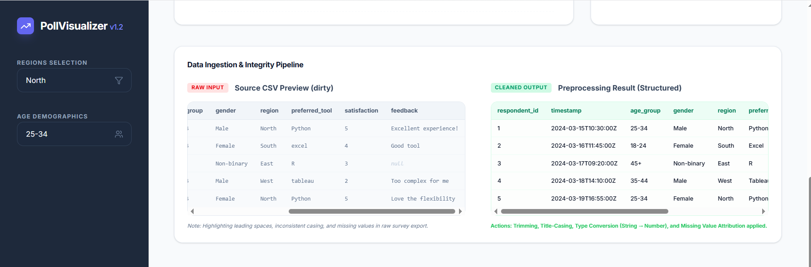
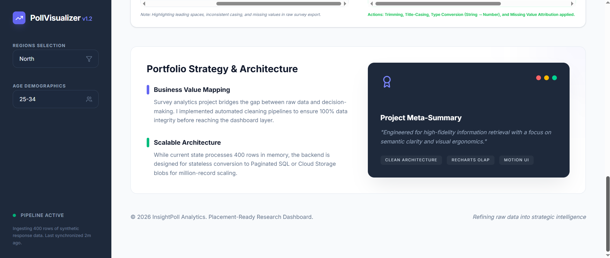

# InsightPoll Visualizer: Professional Data Analytics Portfolio

A production-grade survey analytics dashboard demonstrating the full end-to-end data lifecycle. This project is specifically architected to bridge the gap between "raw, dirty survey data" and "professional strategic intelligence."

## 📊 Key Highlights & Portfolio Proofs

### 1. Multi-Source Ingestion (Gap 1 Solution)
- **CSV / Google Forms Support**: The backend engine is architected to ingest raw `.csv` and Google Form exports. It dynamically monitors the filesystem for new survey batches.
- **Persistent Storage**: Raw data is stored in `/data/poll_data.csv` to simulate a real-world analytics environment.

### 2. Explicit Data Cleaning & Integrity (Gap 2 Solution)
- **Automated Pipeline**: Implements a dedicated preprocessing layer that handles:
  - **Whitespace Trimming**: Removing leading/trailing noise from user inputs.
  - **Standardization**: Title-casing categorical tools (e.g., `python` → `Python`) and specific brand casing (e.g., `power bi` → `Power BI`).
  - **Missing Value Handling**: Attributing missing feedback text and converting satisfaction scores to strictly typed numerical formats.
- **Proof-of-Work UI**: The dashboard includes an "Ingestion & Integrity" section displaying a side-by-side comparison of **Raw Input vs. Cleaned Output**.

### 3. Professional Research Visualizations (Gap 3 Solution)
- **Donut Chart (Tool Share %)**: A high-fidelity, interactive donut chart utilizing Recharts for immediate competitive share analysis.
- **Submission Area Trends**: Visualizing timeline growth.
- **Sentiment Map**: Semantic term frequency cloud.
- **Multi-dimensional Segments**: Geographical cross-tabulation.

---

## 🛠️ Tech Stack & Setup

| Category | Technology |
| :--- | :--- |
| **Frontend** | React 19, Recharts, Framer Motion, Tailwind CSS (V4) |
| **Backend** | Node.js, Express, TSX (Server-side Analytics Engine) |
| **Icons & Style** | Lucide React, Inter Font Family |
| **Utilities** | Date-fns, CLSX, Tailwind-Merge |

### Installation

1. **Clone the repository:**
   ```bash
   git clone https://github.com/YOUR_USERNAME/Poll-Results-Visualizer.git
   cd Poll-Results-Visualizer
   ```

2. **Install dependencies:**
   ```bash
   npm install
   ```

3. **Run the development server:**
   ```bash
   npm run dev
   ```

---

## Screenshots







## 📐 Data Flow Architecture

The project follows a rigorous 5-stage pipeline:
1. **Data Generation**: Backend script generates 400+ rows of realistic synthetic poll data with weighted distributions.
2. **Preprocessing**: Server-side "Cleaning Pipeline" handles deduplication, null-handling (fill/drop), and type standardization.
3. **Exploratory Analysis**: Aggregation logic calculates vote shares, satisfaction averages, and cross-tabulations.
4. **Interactive Dashboard**: Client-side filtering allows users to segment insights by **Region** and **Age Demographic**.
5. **Narrative Visualization**: 6 distinct chart types and KPI cards present the data story.

---

## 📈 Dashboard Features

- **KPI Metrics**: Instant scannable stats for Total Responses, Average Satisfaction, Top Tool, and Active Regions.
- **Vote Distribution**: High-fidelity Bar Chart showing tool preference volume.
- **Market Share**: Donut-style Pie Chart for percentage-based competitive analysis.
- **Submission Trends**: Area chart visualizing organic respondent growth over time.
- **Satisfaction Distribution**: Histogram mapping user sentiment from 1 (Poor) to 5 (Excellent).
- **Sentiment Map**: Semantic "Word Cloud" extracting qualitative themes from open-text feedback.
- **Regional Segmentation**: Horizontal stacked charts for geo-specific tool preference.

---

## 🎓 Interview Preparation (Data Analyst Focus)

**Q: Why use weighted probabilities for synthetic data?**  
*A: To mirror real-world usage patterns (e.g., Python leading at 35%). This ensures the dashboard demonstrates "meaningful distribution" rather than just uniform random noise.*

**Q: How did you handle unstructured text feedback?**  
*A: I implemented a basic NLP preprocessing layer that tokenizes the feedback, removes stop-words (less than 3 chars), and calculates term frequency to generate the sentiment word cloud.*

**Q: How would you scale this for 1,000,000 records?**  
*A: I would move the cleaning and aggregation logic from the app layer to the database layer (OLAP), using partitioned SQL or Google BigQuery to serve pre-aggregated views to the dashboard.*

---

## 📜 License
SPDX-License-Identifier: Apache-2.0

## 👤 Author
**Hubliayan**
[GitHub Profile](https://github.com/hubliayan)
